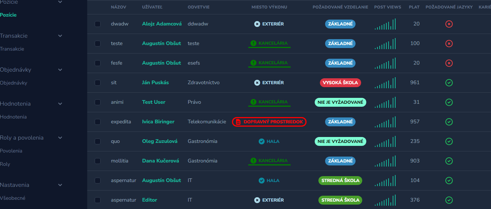
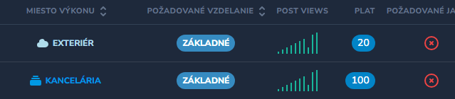

# SelectBadge Field

## 1. Preview



<br>

## 2. Info 
Package combines Select field and Badge field, adds styled classes in CSS and adds functions such as icons(), map(), addTypes(), options(), labels().
-  Added to BelongsBaadge ! <br>
- You can use to like Badge 
```php
->displayUsing(fn($value)=> '<span class="' .config('wame-badge.info-white'). '">' . $value . '</span>')->asHtml()
```


### Added files:
```php
 resources/css/labels-status.css - register to NovaProvider,
 config/wame-badge.php - config('wame-badge.warning'),
 Models/Trait/Statuses.php  --add to model,
 App\Utils\Helpers\MyFields function SelectBadge; 
```

### Function
```php
public static function selectBadge($select, $options, $map, $types, $icons){
    return [
        Select::make(__('fields.' .$select), $select)
            ->filterable()
            ->displayUsingLabels()
            ->onlyOnForms()
            ->options($options)
            ->rules('required')->required(),
        Badge::make(__('fields.' . $select), $select)
            ->sortable()
            ->map($map)
            ->hideWhenCreating()->hideWhenUpdating()
            ->addTypes($types)
            ->icons($icons ? $icons : $types)
            ->labels($options),
    ];
}

public static function belongsBadge($select, $options, $map, $types, $icons){
    return [
        BelongsTo::make(__('fields.' .$select), $select)
            ->filterable()
            ->sortable()
            ->onlyOnForms(),
        Badge::make(__('fields.' . $select), $select)
            ->map($map)
            ->hideWhenCreating()->hideWhenUpdating()
            ->addTypes($types)
            ->icons($icons ? $icons : $types)
            ->labels($options),
    ];
}
```
<br>

## 3. Instalation

- ### vendor publish  --SelectBadgeServiceProvider
```php
php artisan vendor:publish --provider="Wame\SelectBadge\StatusesServiceProvider"
```
<br>

## 4. Usage

- ### Add to your Model Trait 
``` php
Models/Trait/BadgeStatuses.php

use App\Models\Traits\BadgeStatuses;
use BadgeStatuses;
```
- ### Add fields to your Nova Model
``` php
use App\Utils\Helpers\SelectBadge;

...SelectBadge::select('place_execution', $this->place(), $this->placeMap(), $this->placeType(), $this->placeIcons()  ),
``` 

- ### Edit trait example:
```php
    const
        OFFICE = 1,
        HALL = 2,
        EXTERIOR = 3,
        MOBILE = 4;

    public function place(): array
    {
        return [
            self::OFFICE => __('fields.office'),
            self::HALL => __('fields.hall'),
            self::EXTERIOR => __('fields.exterior'),
            self::MOBILE => __('fields.mobile'),
        ];
    }

    // uprava css / nalepky 
    // you can use css class or tailwind classes from config too : config('wame-badge.info')
    public function placeType(){
        return [
            'office' => 'status-color-blue',
            'hall' => 'status-color-teal',
            'exterior' =>  'status-color-coral',
            'mobile' => 'status-color-aquamarine',
           // 'edit' => config('wame-badge.warning'),
        ];
    }

    public function placeMap(){
        return [
            \App\Models\Position::OFFICE => 'office',
            \App\Models\Position::HALL => 'hall',
            \App\Models\Position::EXTERIOR => 'exterior',
            \App\Models\Position::MOBILE => 'mobile',
        ];
    }

// Add Icons 
    public function placeIcons(){
        return [
            'office' => 'exclamation-circle',
            'hall' => 'check-circle',
            'exterior' => 'x-circle',
            'mobile' => 'document-text',
        ];
    }
```
<br>

## 5. Configuration / Customization
<br>
### You can add your custom classes 

### If you dont want Icons use null:
``` php
  ...SelectBadge::select('place_execution', $this->place(), $this->placeMap(), $this->placeType(), null  ),
````

Icons can find here:  https://v1.heroicons.com/
<br><br>

## 6. Badges class:
<table>
    <tr>
        <td style="background:#DC3545; color:white">red</td>
        <td style="background:#4AA02C; color:white">green</td>
        <td style="background:#6cc24a; color:white">green2</td>
        <td style="background:#0099e5; color:white">blue</td>
        <td style="background:#368BC1; color:white">ice</td>
        <td style="background:#0a8ea0; color:white">teal</td>
        <td style="background:#1cc7d0; color:white">teal2</td>
        <td style="background:#AFDCEC; color:black">coral</td>
        <td style="background:#7FFFD4; color:black">aquamarine</td>
        <td style="background:#EAC117; color:white">golden</td>
        <td style="background:#ef9421; color:white">orange</td>
        <td style="background:#fdb94e; color:white">orange-light</td>
        <td style="background:#bff199; color:black">green-light</td>
        <td style="background:#79ceb8; color:white">green-dark</td>
        <td style="background:#f7afff; color:white">pink</td>
        <td style="background:#836eaa; color:white">purple</td>
    </tr>
</table>

<table>
    <tr>
        <td style="background:#DC3545; color:white">config('wame-badge.error')</td>
        <td style="background:#bff199; color:black">config('wame-badge.denied')</td>
        <td style="background:#4AA02C; color:white">config('wame-badge.approved')</td>
        <td style="background:#0099e5; color:white">config('wame-badge.info')</td>
        <td style="background:#AFDCEC; color:black">config('wame-badge.default')</td>
        <td style="background:#EAC117; color:white">config('wame-badge.warning')</td>
    </tr>
</table>
<table>
    <tr>
        <td style="background:#DC3545; color:white">config('wame-badge.error-white')</td>
        <td style="background:#bff199; color:black">config('wame-badge.denied-white')</td>
        <td style="background:#4AA02C; color:white">config('wame-badge.approved-white')</td>
        <td style="background:#0099e5; color:white">config('wame-badge.info-white')</td>
        <td style="background:#AFDCEC; color:black">config('wame-badge.default-white')</td>
        <td style="background:#EAC117; color:white">config('wame-badge.warning-white')</td>
    </tr>
</table>


### classes:
- status-bg-[color]
- status-color-[color]
- status-line-[color]
- status-border-[color]

### more: 
- primary 
- none
